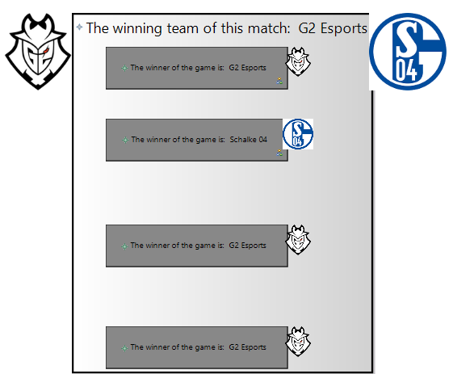

# TDT4250_LeagueOfLegends

   
   
   
 

This is a project delivery for the NTNU course TDT4250, created by Henrik Knudsen, Hallvard EchterMeyer, Stian Mahle and Rune Strøm Brekke.

## Installation guide

**NB**: Java runtime environment (Version 8) is required to run the project.

The project can be installed and ran by following these instructions:

1. Download the github repository.
2. Install your choice of Eclipse IDE.
3. Install project dependencies:
   1. EMF modelling tools
   2. Sirius
   3. Eclipse Developer tools
4. Import the repository's content into your eclipse workspace.
5. Create a new runtime configuration based on the project and launch a separate eclipse application with it.
6. Import LeagueOfLegends and LeagueOfLegends.project projects into the eclipse application.

The application should now be ready to be tried out:
1. The provided model instance (leagueoflegends.leagueoflegends) can now be inspected within the LeagueOfLegends project.
2. Any new representations can be created through using the Aird editor with representations.aird, within the LeagueOfLegends project (A representation of the League is already provided, found just under the top level League object in leagueoflegends.leagueoflegends, called "EULCS").
3. The ViewPoint specification can be inspected, through utilizing the ViewPoint Specification Editor on project.odesign, found in LeagueOfLegends.project/description.

## Description

The group chose task 1 for the project assignment:

> Find a public or easily available data source with some volume of data and interesting level of complexity. Model the data using Ecore and implement an transformation facility so you can import, view and process the data using EMF. Then create a viewer and editor for the data using (preferably) Sirius or EMF Forms, that can be installed into Eclipse.

We chose to model matchup data for the popular game League of Legends (LOL), utilizing EMF [[1]](https://www.eclipse.org/modeling/emf/). The game is a team-based game, pitting two 5 person teams against each other. The overall game objective is to earn gold, defeat your opponent's champions and destroy their homebase.

 The data was gathered from [Oracle Elixir's Database](https://oracleselixir.com/match-data/.) and focuses on LOL's european division (EULCS). The data has been read from available CSV files and serialized to a XMI format. It contains data from the 2018 regular season, playoffs and regional qualifiers for the LOL world cup.

## File structure

This section describes the different eclipse projects comprising the application.

### Leagueoflegends

Contains League instance used in Sirius Model View and application's representations.aird file.

### Leagueoflegends.project

Contains the application's Viewpoint Specification.

### tdt4250.project.leagueOfLegends

Contains the application's Ecore Model and its generated src code. Its assets folder also contains a copy of the data source used for the project, in the form of a CSV file.

The project's corresponding .edit, .editor and .tests projects are also included, as separate projects.

## Ecore Model

The project's Ecore model follows a hierarchical structure, with League as its top element, containing data related to a single competitive division. The model has a set of related constraints, to ensure the integrity of its data source.

### Creation of League Instances

League Instances can be created from scratch, using a EMF Model Creation Wizard, or by reading from a CSV file. tdt4250.project.LeagueOfLegends's LeagueOfLegendsResourceImpl contains functionality for looping through such a CSV file and builds a League instance from its content, placed in the local folder *assets*.

### Constraints

A set of constraints for each Ecore model has been implemented, ensuring data integrity. The implementation can be found in tdt4250.project.LeagueOfLegends's LeagueOfLegendsValidator, and have been done through the use of Java, rather than OCL statements.

### League

League has a associated name as well as a set of Seasons, Teams and Champions. It also has a LeagueStats object, an aggregate of selective matchup data, gathered throughout its seasons.

#### LeagueStats

LeagueStats is contained by a league and holds aggregate data (ie. total kills and deaths) for the league, as well as player and champion data (ie. player with most assists, champion with highest Kill/Death/Assist ratio).

### Season

Season represents a unique period of play within a league. There are traditionally three distinct types of seasons: Regular season, playoffs and regional qualifiers. This is indicated by the Season's split type.

Each Season has a name (based on split type and year), is contained within a specific league, and contains a set of matches played between different Teams.

### Match

Match represents a unique matchup between two Teams. A Match contains one or more games. The winner of the match is decided based on how many games each team won and the match's BestOf format.

Each Match also has a unique match id and is contained within a specific season.

#### BestOf

BestOf is an EEnum, depicting the format of a match. A regular season is played with single elimination matches, while all other seasons (playoff and regionals) are played best of 5.

### Game

Game represents a unique game between two Teams. The two teams are identified as either the red or the blue team, with one of them being the winner of the game.

Each Game has a unique game id, is contained within a specific Match and contains a multitude of Stats object, specifically GameStats, GameTeamStats and GamePlayerStats.

#### GamePlayerStats

GamePlayerStats represents a player's stats for a specific game, holding information about their amount of kills, deaths, gold acquired, among other data. As a game is played by a minimum of 10 players, Game contains a minimum of 10 GamePlayerStats objects. 

#### GameTeamStats

GameTeamStats represents a team's stats for a specific game, holding aggregate information based on their player's GamePlayerStats objects.

#### GameStats

GameStats holds aggregate information, based on the participating teams' GameTeamStats objects.

### Team

Team represents a unique team, participating in the league. It has a name, is contained within a specific league and contains a set of players, playing for the team. Its also related to a TeamStats object, containing information about the team's stats throughout the league.

#### TeamStats

TeamStats represents a team's stats throughout the league, holding aggregate information from the team's GameTeamStats, as well as unique team information (ie. which team member had the most kills etc.). 

### Player

Player represents a unique player, participating in the league. The player has a name (Player alias/gamer tag) and is contained within a specific team. They are also related to a PlayerStats object, containing information about the player's stats throughout the league. 

#### PlayerStats

PlayerStats represents a player's stats throughout the league, holding aggregate information from the player's GamePlayerStats.

### Champion

Champion represents a playable character within League of Legends. It has a name associated with it and is contained within a specific League. It's also related to a ChampionStats object, containing information about the champion's stats throughout the league.

#### ChampionStats

ChampionStats represents a champion's stats throughout the league, holding aggregate information from players' GamePlayerStats, where the player played the champion.

## Sirius Editor

The project utilizes Sirius [[2]](https://www.eclipse.org/sirius/overview.html) to create a graphical model workbench, based on the underlying Ecore model. We've created a flexible model view for our model, enabling the user to present statistics regarding League of Legends, via graphical user interfaces. 

Traversing the League instance is done through AQL queries [[3]](https://www.ibm.com/support/knowledgecenter/en/SSPT3X_4.2.5/com.ibm.swg.im.infosphere.biginsights.aqlref.doc/doc/aql-overview.html), allowing for simple selects of the instance's attributes and references.

Navigation between diagrams is done through double clicking graphical elements, creating new diagrams based on the instances if needed.

Sirius allows for the use of Java services, for more complex interactions, unfit for simple AQL queries. This is used when extracting images corresponding to different graphical elements, enabling a better user experience.

**NB**: As the data source is based around competitive tournament data, the overall focus has been on presenting the data to the user, rather than allowing the user to change or create new data themselves. This design decision was made, as we didn't feel individual instances of the model made sense on their own, without the greater context of the League. This was asked about on [piazza](https://piazza.com/class/jzhh4owu30s5vo?cid=29).

### League_Diagram

The League_Diagram corresponds to a League instance and is the top element of our Sirius Model View. It contains a list of Season nodes, a set of Team nodes, a list of champion Nodes and a LeagueStats node. The Season nodes represents a specific Season instance and navigates to a Season_Diagram. The Team nodes represent a specific Team instance and navigates to a Team_Diagram. The Champion nodes represent a specific Champion instance and navigates to a Champion_Diagram. The LeagueStats node represent the League's LeagueStats object, and displays its information in list format.

### Season_Diagram

The Season_Diagram displays the content of a Season instance, following a list format. Each Match contained by the Season is displayed as a list item, and navigates to a Match_Diagram.

### Match_Diagram

The Match_Diagram displays the content of a Match instance. It consists of a main Match node, a set of Team nodes and a set of Game nodes. The Team nodes represent the teams participating in the match and navigates to a corresponding Team_Diagram. The Game nodes represent the games of the match and navigates to corresponding Game_Diagrams.

### Game_Diagram

The Game_Diagram displays the content of a Game instance. It consist of a GameStats container, two GameTeamStats containers and a set of GamePlayerStats containers. The GameStats container represent the Game's GameStats object and display its information in a list format.

The TeamStats containers represent the Game's GameTeamStats objects. They contain a Team node, navigating to its respective Team_Diagram, and displays its information in a list format.

The GamePlayerStats container represent the Game's GamePlayerStats objects. They contain a Player node, navigating to its respective Player_Diagram, and display its information in a list format.

### Team_Diagram

The Team_Diagram displays the content of a Team instance. It consist of a TeamStats container and a set of Player nodes. The TeamStats container represent the Team's TeamStats object and displays its information in a list format. The Player nodes corresponds to a specific Player instance (ie. A player part of the team) and navigates to its respective Player_Diagram.

### Player_Diagram

The Player_Diagram displays the content of a Player instance. It consist of a PlayerStats container and a set of Champion nodes. The PlayerStats container represent the Player's PlayerStats object and display its information in a list format. The Champion nodes corresponds to a specific Champion instance and navigates to its respective Champion_Diagram.

### Champion_Diagram

The Champion_Diagram displays the content of a Champion instance. It contains a ChampionStats node, display the content of its ChampionStats object in a list format.

